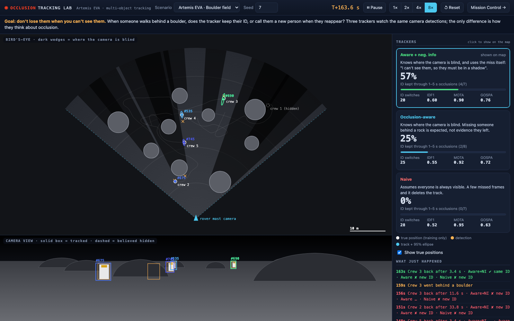
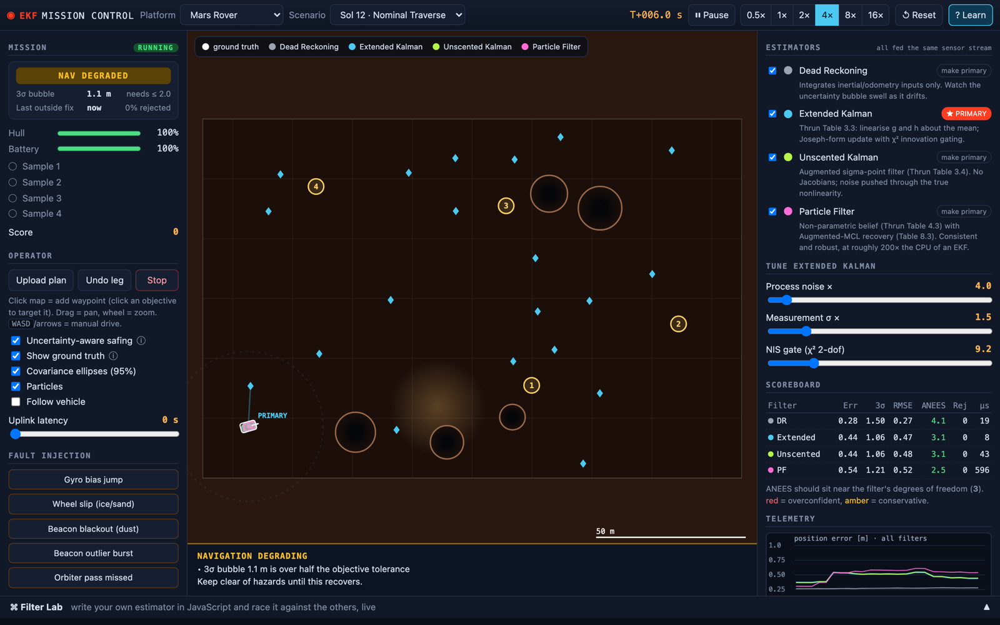

# Lunar Occlusion Tracking Lab

**Goal: don't lose them when you can't see them.** A rover's mast camera tracks astronauts walking among boulders on the Moon. When someone steps behind a rock, does the tracker keep their identity, or call them a new person when they reappear?

This repository answers that question with a controlled, reproducible experiment and an interactive lab where you can watch it happen. It is a portfolio research project in multi-object tracking (MOT) under occlusion, using an Artemis-style lunar EVA scenario.



```bash
npm start                                   # zero dependencies, Node >= 18
open http://localhost:8080/track.html       # Occlusion Tracking Lab
open http://localhost:8080                  # Navigation lab (EKF/UKF/PF mission control)
npm test                                    # 32 tests
node experiments/occlusion_ablation.mjs     # regenerates experiments/results.md (20 seeds x 3 scenarios, ~2 min)
```

## The experiment

Three trackers watch the **same** camera detections. They are identical (constant-velocity EKF per track, χ² gating, likelihood-ratio global-nearest-neighbour association, Bayesian track existence) except for one thing, how they treat occlusion:

| tracker | what it believes when it gets no detection for a track |
|---|---|
| **Naive** | "Everyone is always visible": a few missed frames are evidence the person is gone. |
| **Occlusion-aware** | Knows where the camera is blind (boulder map + field of view). A miss is only evidence of absence in proportion to the *expected* detection probability `P_D × visibility`, averaged over the track's uncertainty. A hidden track also declines detections it does not expect, so it is not hijacked by clutter or a passer-by. |
| **Aware + negative information** | Also uses the miss itself: `p(x | missed) ∝ p(x) (1 − P_D(x))`. Positions in plain view are down-weighted, so the hidden estimate moves *into* the shadow instead of drifting out of it. |

### Results (boulder field, 20 seeds × 300 s, identical detections)

| tracker | ID kept through 1–5 s occlusions | ID kept through ≥ 5 s occlusions | ID switches / run | MOTA |
|---|---|---|---|---|
| Aware + negative info | **30%** [24–37] | 2% [1–3] | 47.8 ± 5.6 | 0.83 ± 0.02 |
| Occlusion-aware | **28%** [22–34] | 2% [1–3] | 51.6 ± 5.6 | 0.87 ± 0.02 |
| Naive | **0%** [0–2] | 0% [0–1] | 58.6 ± 6.9 | 0.93 ± 0.01 |

Brackets are Wilson 95% intervals; ± is 1.96 × standard error over seeds. All three scenarios, plus IDF1 and GOSPA, are in [`experiments/results.md`](experiments/results.md), which the script above regenerates and stamps with the git commit.

**What the data says**
* **Occlusion modelling is what lets a tracker survive short occlusions at all**: 0% → ~30% of identities kept, and ~18% fewer ID switches.
* **It has a cost**: MOTA drops ~6–10 points, because tracks kept alive through occlusion also keep some false tracks alive longer. That trade-off is real and is reported, not hidden.
* **Long occlusions (≥ 5 s) defeat motion-only tracking** (≤ 6% kept for every variant in every scene). People change direction while unseen, and no motion model recovers that. This is the quantitative case for **appearance re-identification** (see roadmap).
* **Negative information helps a little**: most in the sparse-cover scene (47% [36–59] vs 30% [21–41], intervals overlap slightly) and marginally elsewhere. Not yet a statistically clear win, and reported as such.

### How it is built (and how it was debugged)
* **Occlusion geometry** (`src/mot/occlusion.js`): angular line-of-sight occlusion of a target disk by closer boulder disks, giving a visible fraction, `P_D(visibility)`, and the centroid shift a real detector shows under partial occlusion.
* **Sensor** (`src/mot/world.js`): stereo-like range/bearing detections with range-dependent noise, Poisson clutter, missed detections. Identities are never passed to the trackers (a test enforces this).
* **Tracker** (`src/mot/tracker.js`): per-track CV EKF; assignment by Hungarian algorithm over costs `−log(P_D g / κ)` with an explicit "missed" option `−log(1 − P_D P_G)`; Bernoulli-filter existence update; the three variants above.
* **Metrics** (`src/mot/metrics.js`): CLEAR-MOT (MOTA, MOTP, ID switches), IDF1, GOSPA, and occlusion events binned by duration, plus survival and 95% coverage of hidden tracks.
* The first version kept only 5–9% of identities. Diagnostics traced this to false tracks confirmed from clutter, then to coasting tracks being **hijacked** by nearby detections, then to estimates drifting out of the shadow. Each was fixed with the standard remedy (clutter-aware existence update, miss-option assignment, negative-information update), and each step was measured.

## Second lab: navigation filters under faults



`index.html` is an ego-navigation lab. Fly a **Mars rover, a fighter jet or a spacecraft** (Clohessy-Wiltshire docking) through injected faults while dead reckoning, EKF, UKF and a particle filter estimate the vehicle's own state on the same sensor stream. It includes:
* an onboard-only **Navigation Health** monitor;
* a **Coach** that narrates what is happening;
* a guided tour;
* a **Filter Lab** for writing your own estimator in the browser.

Filters follow *Probabilistic Robotics* (Thrun, Burgard, Fox): Tables 3.3, 3.4, 4.3/4.4 and 8.3, with every analytic Jacobian checked against finite differences. Mapping: [`docs/THEORY.md`](docs/THEORY.md). Operator's guide: [`docs/GUIDE.md`](docs/GUIDE.md).

Position RMSE in metres, 5 seeds, identical sensor streams (full table with consistency in [`bench/results.md`](bench/results.md)):

| scenario | DR | EKF | UKF | PF |
|---|---:|---:|---:|---:|
| rover · nominal | 17.0 | 0.27 | 0.26 | 0.26 |
| rover · dust storm | 64 | 4.0 | 4.9 | 1.6 |
| jet · GNSS denied | 4350 | 9.1 | 9.1 | 9.3 |
| spacecraft · approach | 40 | 0.23 | 0.23 | 0.32 |

Modelling the disturbances as states (wheel slip, wind, accelerometer bias) fixed earlier divergences. For example, the jet EKF went from ~1.5 km error to ~9 m once wind was a state.

**Language choice, measured.** The rover EKF was ported to C++17 and Python/numpy and replayed on one recorded trace (`bench/xlang/`). All three agree to ~4e-10. Per step: C++ ≈ 0.1 µs (0.08–0.13 across runs), JS ≈ 2.5 µs, numpy ≈ 9 µs. Caveats: single trace, single machine, rover model only. At this state size all three are far inside a 20 Hz budget, so the choice follows the job: browser JS for this interactive lab, C++ for embedded/flight-style code, Python for offline analysis.

## Roadmap
1. **3-D camera and depth-buffer occlusion.** Use a pinhole camera on a mast and rasterised visibility masks (the PyTorch3D camera/rasterizer approach), so a person behind a low rock is partially visible over it, as a real camera would see. The masks double as segmentation (MOTS).
2. **Appearance re-identification** for long occlusions, linking to SAM-based MOTS work in a separate repository.
3. **Python reference implementation** and evaluation on real occlusion-labelled data (MOT17 / KITTI tracking) with HOTA via TrackEval.
4. **IMM motion models** for turning targets.

## Limitations (so you can trust the rest)
* **Simulator, not NASA software.** This is an independent portfolio project. It is not affiliated with or endorsed by NASA, and nothing here is flight-qualified.
* **2-D (planar) world.** Occlusion is computed in the ground plane, so height is ignored (roadmap item 1). Walkers are simulated, and detections come from a sensor model rather than a neural detector.
* **The navigation lab's dynamics are time-compressed** (rover ~1 m/s, spacecraft mean motion ~9× real LEO), and its sensor noise values are plausible, not characterised from hardware.
* **No ROS 2 node has been built.** ROS isn't installed on the development machine.
* **UI testing:** UIs are tested by a stub-DOM test (every code path) and were inspected in a headless Chromium at several window sizes and pixel ratios. They have not been tested on mobile.

## Layout
```
src/mot         occlusion geometry, lunar world + detector, MOT tracker, Hungarian, MOT metrics
src/core        rng, linear algebra, arc kinematics, numerical Jacobians
src/models      rover · jet · spacecraft estimation models
src/filters     DR, EKF, UKF, particle filter
src/platforms   truth dynamics + sensors + autopilot per vehicle
src/sim         mission engine, scenarios, metrics
src/ui          both labs' front ends (track.js = Occlusion Lab)
experiments/    reproducible occlusion ablation + results.md
test/  bench/   tests, navigation benchmarks, cross-language proof
docs/           operator's guide, theory map, screenshots
```

MIT licensed (see `LICENSE`).
