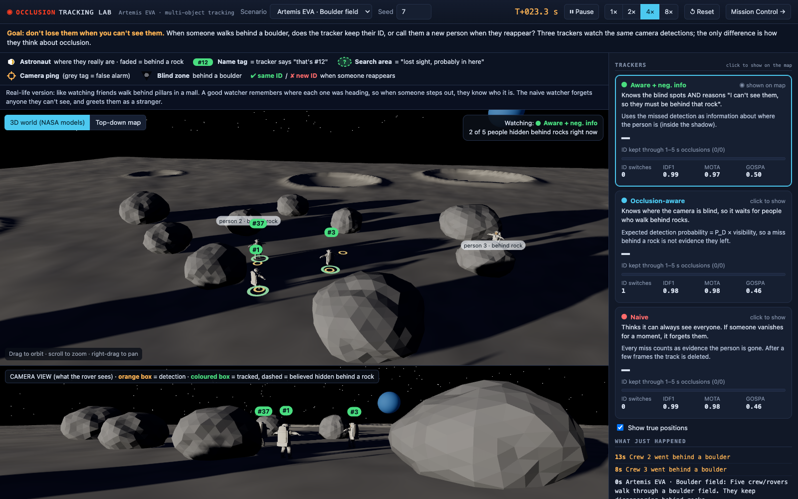
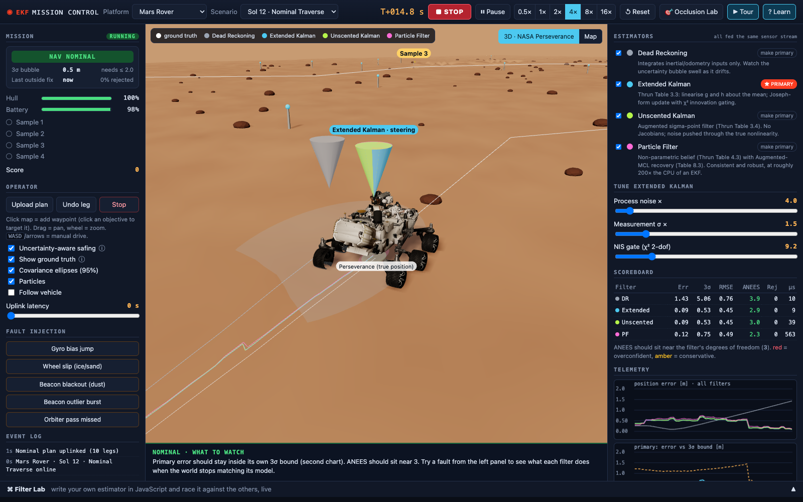

# Lunar Occlusion Tracking Lab

**Goal: don't lose them when you can't see them.** A rover's mast camera tracks astronauts walking among boulders on the Moon. When someone steps behind a rock, does the tracker keep their identity, or call them a new person when they reappear?

This repository answers that question with a controlled, reproducible experiment and an interactive lab where you can watch it happen. It is a portfolio research project in multi-object tracking (MOT) under occlusion, using an Artemis-style lunar EVA scenario.



The lab runs in **real-time 3-D** (Three.js/WebGL) with **official NASA 3-D models**: astronauts, the RASSOR lunar robot carrying the camera, and the Apollo Lunar Module. Lighting is modelled on the lunar south pole, the target region for crewed lunar landings: a low sun casting long shadows (~7° elevation here; the real polar sun is lower still, ~1–2°, raised slightly so the scene stays readable). The camera robot's view is rendered from its mast with the GPU depth buffer, so you see occlusion exactly as a real camera would. A top-down map view is one click away.

```bash
npm start                                   # zero dependencies, Node >= 18
open http://localhost:8080/track.html       # Occlusion Tracking Lab
open http://localhost:8080                  # Navigation lab (EKF/UKF/PF mission control)
npm test                                    # 45 tests
node experiments/occlusion_ablation.mjs     # regenerates experiments/results.md (20 seeds x 3 scenarios, ~2 min)
```

## Learn it

* **[The trackers, ranked](docs/TRACKERS.md):** every tracker as one step toward tracking through occlusion (naive → occlusion-aware → negative information → appearance re-ID → second camera → lidar), with measured results and MathWorks' GNN, JIPDA and TOMHT for comparison.
* **[Learning guide](docs/OCCLUSION_GUIDE.md):** every idea in plain words, then the maths, then the exact code location, then the paper behind it, then something to try in the lab.
* **[References](docs/REFERENCES.md):** every method traced to the literature (tracking, data association, existence, evaluation, lunar illumination). Each citation was checked against publisher or index records. The file also says honestly what is standard here and what is not claimed.
* **In the lab:** a 10-step **▶ Tour**, a **What if…?** panel (detection rate, false alarms, crowd size, low rocks, polar shadows), a live ID-switch chart, and a glossary with links into the guide.

## The experiment

Three trackers watch the **same** camera detections. They are identical (constant-velocity EKF per track, χ² gating, likelihood-ratio global-nearest-neighbour association, Bayesian track existence) except for one thing, how they treat occlusion:

| tracker | what it believes when it gets no detection for a track |
|---|---|
| **Naive** | "Everyone is always visible": a few missed frames are evidence the person is gone. |
| **Occlusion-aware** | Knows where the camera is blind (boulder map with heights, field of view, and the sun for cast shadows). A miss is only evidence of absence in proportion to the *expected* detection probability `P_D × visibility`, averaged over the track's uncertainty. A hidden track also declines detections it does not expect, so it is not hijacked by clutter or a passer-by. |
| **Aware + negative information** | Also uses the miss itself: `p(x | missed) ∝ p(x) (1 − P_D(x))`. Positions in plain view are down-weighted, so the hidden estimate moves *into* the shadow instead of drifting out of it. |

### Results (20 seeds × 300 s per scenario, identical detections, 3-D visibility)

| scenario | tracker | ID kept through 1–5 s occlusions | ID switches / run | MOTA |
|---|---|---|---|---|
| Boulder field | Aware + negative info | **46%** [40–52] | 47.8 ± 5.3 | 0.90 ± 0.02 |
| | Occlusion-aware | **36%** [31–42] | 54.0 ± 5.3 | 0.93 ± 0.02 |
| | Naive | **0%** [0–1] | 75.6 ± 9.1 | 0.94 ± 0.01 |
| South pole · long shadows | Aware + negative info | **45%** [40–51] | 51.3 ± 5.4 | 0.84 ± 0.02 |
| | Occlusion-aware | **36%** [31–42] | 60.7 ± 5.7 | 0.86 ± 0.02 |
| | Naive | **0%** [0–2] | 129.4 ± 13.0 | 0.80 ± 0.02 |

Brackets are Wilson 95% intervals; ± is 1.96 × standard error over seeds. All four scenarios, plus IDF1, GOSPA and occlusions of 5 s or more, are in [`experiments/results.md`](experiments/results.md). The script above regenerates them and stamps them with the git commit.

**What the data says**
* **Occlusion modelling is what lets a tracker survive occlusions at all.** Retention through short occlusions goes from 0% to roughly a third to a half (32–63% across the four scenes), and ID switches drop by 37% (boulder field) to 60% (polar shadows).
* **Under realistic lunar lighting it is not a trade-off.** In the polar scene the naive tracker loses people in long cast shadows as well as behind rocks. It switches IDs 2.5× more often and also has the *worst* MOTA. In the boulder field the aware trackers give up 1–4 MOTA points (some tracks are kept alive longer), which is reported, not hidden.
* **Negative information is consistently better than plain awareness**: 46 vs 36%, 45 vs 36%, 33 vs 32% and 63 vs 40% across the four scenes. Each interval overlaps slightly, so the claim is "consistently better", not "proven better".
* **Long occlusions (≥ 5 s) still defeat motion-only tracking** (≤ 12% kept for every variant in every scene). People change direction while unseen, and no motion model recovers that. This is the quantitative case for **appearance re-identification** (see roadmap).

### How it is built (and how it was debugged)
* **Occlusion physics** (`src/mot/occlusion.js`): 3-D line of sight from a 2.2 m mast camera to 16 points on each 1.8 m person (4 heights × 4 widths) against half-buried ellipsoid boulders. Low rocks hide legs but not heads; tall rocks hide everything. Cast shadows under a low polar sun (rays from the body toward the sun) reduce detectability even in plain view. From these come the visible fraction, `P_D`, and the centroid shift a real detector shows under partial occlusion. The 3-D view uses the same boulder heights and sun direction, so what you see is what is measured.
* **Sensor** (`src/mot/world.js`): stereo-like range/bearing detections with range-dependent noise, Poisson clutter, missed detections. Identities are never passed to the trackers (a test enforces this).
* **Tracker** (`src/mot/tracker.js`): per-track CV EKF; assignment by Hungarian algorithm over costs `−log(P_D g / κ)` with an explicit "missed" option `−log(1 − P_D P_G)`; Bernoulli-filter existence update; the three variants above.
* **Metrics** (`src/mot/metrics.js`): CLEAR-MOT (MOTA, MOTP, ID switches), IDF1, GOSPA, and occlusion events binned by duration, plus survival and 95% coverage of hidden tracks.
* The first version kept only 5–9% of identities. Diagnostics traced this to false tracks confirmed from clutter, then to coasting tracks being **hijacked** by nearby detections, then to estimates drifting out of the shadow. Each was fixed with the standard remedy (clutter-aware existence update, miss-option assignment, negative-information update), and each step was measured.

## Second lab: navigation filters under faults



The rover platform now renders in **3-D with NASA's official Mars 2020 Perseverance model**. Craters are real depressions at the hazard positions, beacons are navigation posts, and samples are flags. Each estimator's belief is a coloured marker with its 95% uncertainty disc on the ground. An estimator's name appears when it disagrees with the steering estimator by more than 2 m. Click the ground to send a waypoint. The spacecraft platform renders **rendezvous and docking with NASA's Gateway**: the Gateway model at the docking target, NASA's ESAS crew module (Orion's design predecessor) as the chaser, tumbling debris fields, approach gates as hoops, and the Moon below. The Gateway file was compressed from 66 MB to 3.8 MB for the web (details in `assets/nasa/README.md`). The fighter jet has no NASA model, so it stays on the 2-D map rather than using an invented one.

`index.html` is an ego-navigation lab. Fly a **Mars rover, a fighter jet or a spacecraft** (Clohessy-Wiltshire docking) through injected faults while dead reckoning, EKF, UKF and a particle filter estimate the vehicle's own state on the same sensor stream. It includes:
* an onboard-only **Navigation Health** monitor;
* a **Coach** that narrates what is happening;
* a guided tour;
* a **Filter Lab** for writing your own estimator in the browser.

Filters follow *Probabilistic Robotics* (Thrun, Burgard, Fox): Tables 3.3, 3.4, 4.3/4.4 and 8.3, with every analytic Jacobian checked against finite differences. Mapping: [`docs/THEORY.md`](docs/THEORY.md). Operator's guide: [`docs/GUIDE.md`](docs/GUIDE.md).

Position RMSE in metres, 5 seeds, identical sensor streams (full table with consistency in [`bench/results.md`](bench/results.md)):

| scenario | DR | EKF | UKF | PF |
|---|---:|---:|---:|---:|
| rover · nominal | 17.0 | 0.27 | 0.26 | 0.26 |
| rover · dust storm | 64 | 4.0 | 4.9 | 1.6 |
| jet · GNSS denied | 4350 | 9.1 | 9.1 | 9.3 |
| spacecraft · approach | 40 | 0.23 | 0.23 | 0.32 |

Modelling the disturbances as states (wheel slip, wind, accelerometer bias) fixed earlier divergences. For example, the jet EKF went from ~1.5 km error to ~9 m once wind was a state.

**Language choice, measured.** The rover EKF was ported to C++17 and Python/numpy and replayed on one recorded trace (`bench/xlang/`). All three agree to ~4e-10. Per step: C++ ≈ 0.1 µs (0.08–0.13 across runs), JS ≈ 2.5 µs, numpy ≈ 9 µs. Caveats: single trace, single machine, rover model only. At this state size all three are far inside a 20 Hz budget, so the choice follows the job: browser JS for this interactive lab, C++ for embedded/flight-style code, Python for offline analysis.

## Roadmap
1. **Detections from rendered images.** Replace the sensor model with a detector running on the rendered camera images, and use the depth/ID buffer masks as segmentation ground truth (MOTS).
2. **Synthetic MOTS dataset with PyTorch3D.** Render the same scenes offline (images, per-person masks, depth, IDs) to train and evaluate SAM-style trackers.
3. **Appearance re-identification** for long occlusions, linking to SAM-based MOTS work in a separate repository.
4. **Python reference implementation** and evaluation on real occlusion-labelled data (MOT17 / KITTI tracking) with HOTA via TrackEval.
5. **IMM motion models** for turning targets.

## Credits
* **3-D models:** NASA 3D Resources (https://github.com/nasa/NASA-3D-Resources): Astronaut, RASSOR, Apollo Lunar Module, Mars 2020 Perseverance, Gateway, ESAS Crew Module. Model scales are set to approximate real-world sizes. NASA states these assets are free and without copyright, and their use follows NASA's media usage guidelines. Details: [`assets/nasa/README.md`](assets/nasa/README.md). **No NASA endorsement of this project is implied.**
* **Rendering:** Three.js r169 (MIT), vendored in `vendor/three/` so the app runs offline.

## Limitations (so you can trust the rest)
* **Simulator, not NASA software.** This is an independent portfolio project. It is not affiliated with or endorsed by NASA, and nothing here is flight-qualified.
* **Simplified world.** The experiment assumes locally flat ground (the 3-D view adds gentle regolith relief, and keeps scenery craters outside the camera's view). Shadow darkness is a fixed detectability penalty, not a photometric camera model. Walkers are simulated, and detections come from a sensor model rather than a neural detector.
* **The navigation lab's dynamics are time-compressed** (rover ~1 m/s, spacecraft mean motion ~9× real LEO), and its sensor noise values are plausible, not characterised from hardware.
* **No ROS 2 node has been built.** ROS isn't installed on the development machine.
* **UI testing:** UIs are tested by a stub-DOM test (every code path) and were inspected in a headless Chromium at several window sizes and pixel ratios. They have not been tested on mobile.

## Layout
```
src/mot         occlusion geometry, lunar world + detector, MOT tracker, Hungarian, MOT metrics
src/core        rng, linear algebra, arc kinematics, numerical Jacobians
src/models      rover · jet · spacecraft estimation models
src/filters     DR, EKF, UKF, particle filter
src/platforms   truth dynamics + sensors + autopilot per vehicle
src/sim         mission engine, scenarios, metrics
src/ui          both labs' front ends (track.js = Occlusion Lab; world3d / mars3d / space3d = 3-D views; three-common = shared)
assets/nasa     official NASA 3-D models (see its README for terms)
vendor/three    Three.js r169 (MIT), loaders + Draco decoder
experiments/    reproducible occlusion ablation + results.md
test/  bench/   tests, navigation benchmarks, cross-language proof
docs/           operator's guide, theory map, screenshots
```

MIT licensed (see `LICENSE`).
